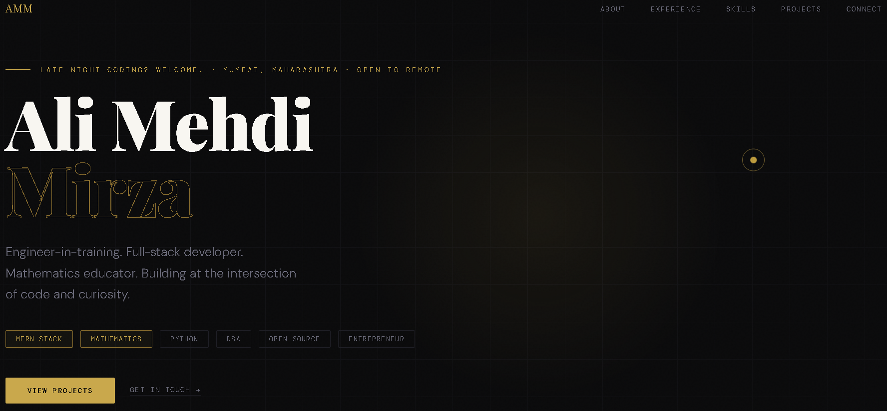

# Ali Mehdi Mirza | Personal Portfolio

> A minimalist, high-performance developer portfolio built to showcase projects at the intersection of code and curiosity. 

  
*(Note: Replace the link above with a screenshot of your actual live website)*

## ⚡ Overview
This repository contains the source code for my personal portfolio. Designed with a strict "less is more" aesthetic, it utilizes a dark-themed UI with gold typography to maintain a premium, professional brand. The site completely bypasses heavy JavaScript frameworks in favor of lightning-fast Vanilla web technologies.

## ✨ Key Features
- **Zero-Dependency Architecture:** Built entirely without external frameworks (No React, Vue, or heavy libraries) to ensure sub-second load times.
- **Smart Contextual Engine:** Implements a time-aware JavaScript function that dynamically alters the hero section greeting based on the user's local timezone.
- **"Explain Like I'm 5" AI Toggle:** Features a custom UI toggle on technical projects (like PashuNet-AI) allowing users to switch between deep technical jargon and simplified, non-technical summaries.
- **Magnetic Custom Cursor:** A custom-engineered Web API cursor with mathematical interpolation (`requestAnimationFrame`) to provide smooth, tactile feedback on hover states.
- **Responsive CSS Grid/Flexbox:** Fluid layout adaptation across all viewport sizes using modern CSS properties and root variables for easy theming.

## 🛠️ Tech Stack
- **Structure:** HTML5
- **Styling:** CSS3 (Custom Properties, Keyframe Animations, CSS Grid)
- **Logic:** Vanilla JavaScript (DOM Manipulation, Intersection Observer API)

## 🚀 Local Deployment
Because this project uses vanilla web technologies, running it locally is completely frictionless.

1. Clone the repository:
   ```bash
   git clone [https://github.com/ali0786mehdi/portfolio.git](https://github.com/ali0786mehdi/portfolio.git)
